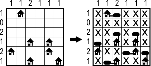

# Heating tanks problem

This project aims to solve a problem of placing heating tanks next to homes. The amount of tanks should be equal to the number of homes. Each house has to be connected with at least one tank, only edge connections count. Tanks must not be connected to each other (with neither edges nor corners). Numbers on the edges of the board tell how many tanks should each column or row contain. Each puzzle has exactly one solution.

An example problem with solution is presented below: 

## Requirements:

* [Haskell Platform](https://www.haskell.org/platform/)

Note: on Ubuntu you may simply execute `$ apt-get install haskell-platform`.

## Running

To make the program simply execute:

	$ ghc --make solution

Than you can execute it by invokink:

	$ ./solution

## Input structure

The input file that has to be provided as an argument must follow the structure:

* the first line should be a list of numbers from the left side of the board
* the second line should be a list of numbers from the top of the board
* the third line should be a list of pairs (coordinates) that describe the position of each home

An input file for an example provided on the image above would be as following:

	[1, 0, 2, 1, 2, 1]
	[1, 1, 2, 1, 1, 1]
	[(0, 1), (3, 2), (3, 4), (4, 0), (4, 4), (5, 2), (5, 5)] 

